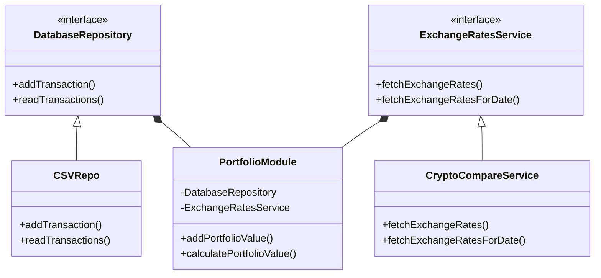

# crypto-portfolio-ts

[](https://badge.fury.io/js/crypto-portfolio-ts)
[](https://www.npmjs.com/package/crypto-portfolio-ts)

## Guide

1. Create file `.dev.env` under the root folder
2. Insert `CRYPTO_COMPARE_API_KEY=<YOUR-API-KEY>` onto `.dev.env` file

---

```bash
# install package
npm install

# transpile TS to JS
tsc

# add to portfolio
node dist/index.js add --type 'DEPOSIT' --token 'BTC' --amount 0.005
node dist/index.js add --type 'WITHDRAWAL' --token 'BTC' --amount 0.002
node dist/index.js add --type 'DEPOSIT' --token 'ETH' --amount 0.1

# calculate portfolio
node dist/index.js calculate
node dist/index.js calculate --date 1616139864
node dist/index.js calculate --token 'BTC'
node dist/index.js calculate --date 1616139864 --token 'BTC'

```

## Diagram



## Code Organization

-   The codebase is divided into different interfaces, providers, and repositories, each with a specific responsibility.
-   The interfaces in the **`interface`** folder define the contracts that different parts of the system must adhere to. For example, the **`DatabaseRepository`** interface defines the methods that a database repository must implement.
-   The providers in the **`provider`** folder implement services that the system can use. For example, the **`CryptoCompareService`** implements the **`ExchangeRatesService`** interface, which provides a way to fetch exchange rates for various crypto tokens.
-   The repositories in the **`repository`** folder provide a way to persist the data used by the system. For example, the **`CSVRepo`** implements the **`DatabaseRepository`** interface, which provides a way to add and read transactions from a CSV file.

## OOP

-   The codebase uses inheritance, composition and implements abstraction, which are core concepts of OOP.
-   The **`CryptoCompareService`** class extends the **`ExchangeRatesService`** interface and implements its methods, which allows it to be used as an instance of **`ExchangeRatesService`**.
-   The **`CSVRepo`** class implements the **`DatabaseRepository`** interface and implements its methods, which allows it to be used as an instance of **`DatabaseRepository`**.
-   The `**PortfolioModule**` have instance of interface **`CryptoCompareService`** and **`ExchangeRatesService`** as properties. This allows for code reuse and flexibility, as well as avoiding the ambiguity and complexity that can come with multiple inheritance.

## SOLID principles

-   The Single Responsibility Principle is followed as each class or interface has a specific responsibility. For example, the **`CryptoCompareService`** class is only responsible for fetching exchange rates, and the **`CSVRepo`** class is only responsible for reading and writing transactions to a CSV file.
-   The Interface Segregation Principle is also followed as different parts of the system only depend on the methods they need. For example, the **`CryptoCompareService`** class only implements the methods it needs from the **`ExchangeRatesService`** interface, and the **`CSVRepo`** class only implements the methods it needs from the **`DatabaseRepository`** interface.

## Clean Code

-   The code is well-structured, easy to read, and has meaningful names for variables and functions.
-   The code uses appropriate error handling and logging, which makes it easier to debug and maintain.
